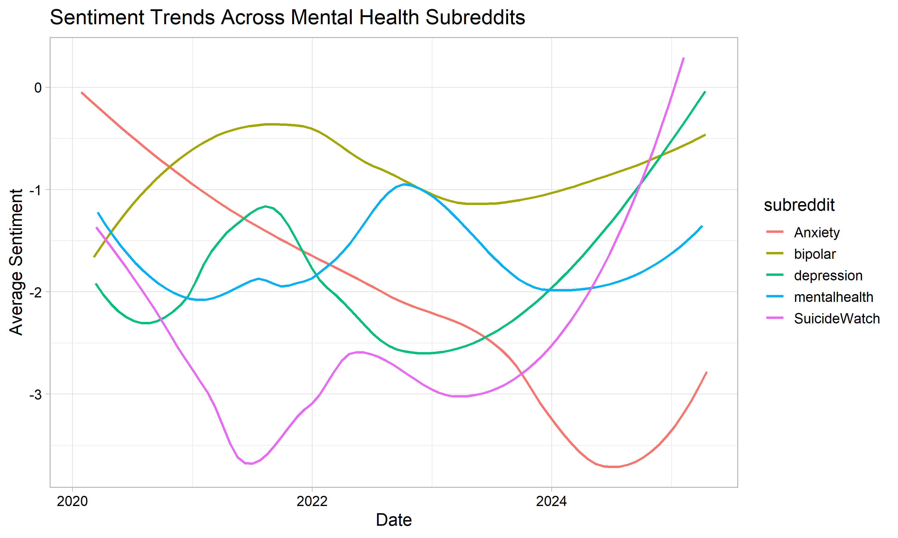

# Mental-Health-COVID19-Reddit-Analysis

## Project Description

This project analyzes Reddit posts related to mental health during the COVID-19 pandemic. It aims to understand how the pandemic has affected mental health by examining trends in Reddit discussions. The analysis includes sentiment analysis and topic modeling of relevant posts. This project uses Python to collect and preprocess data from Reddit, and R to analyze and visualize this collected data.

## Setup and Installation

### Prerequisites

- R (version 4.0.0 or higher)
- Python (version 3.7 or higher)
- Reddit API credentials (client ID, client secret, user agent)

### Installation Steps

1. Clone this repository:

    `git clone https://github.com/mitulvashista123/Mental-Health-COVID19-Reddit-Analysis.git`

    `cd Mental-Health-COVID19-Reddit-Analysis`

2. Install required R packages: 

    `install.packages("tidyverse", "syuzhet", "topicmodels", "ggplot2", "plotly", "dplyr", "scales", "stringr", "lubridate", "tidyr", "readr", "textdata", "tm")`

3. Install required Python packages:

    `pip install praw pandas nltk`

    Next, download the required data with nltk:
    ````
    import nltk
    nltk.download('punkt')
    nltk.download('wordnet')
    nltk.download('stopwords')
    ```` 
6. Obtain Reddit API credentials:
    - Create a Reddit account if you don't have one already.
    - Go to https://old.reddit.com/prefs/apps/
    - Scroll down and click on "create application".
    - Select "script" as the application type.
    - Set the redirect URI to http://localhost:8080
    - After creation, you'll receive your client ID and client secret.

7. Replace the placeholder values in `reddit_bipolar_data.py` with your actual Reddit API credentials.

    ```
    client_id = "YOUR_CLIENT_ID"
    client_secret = "YOUR_CLIENT_SECRET"
    user_agent = "YOUR_USER_AGENT"
    ```
## Code Structure
- reddit_mental_health_data.py: Functions to collect and preprocess Reddit data
- mental_health_covid_analysis.R: Core analysis functions including sentiment analysis, emotion detection, and topic modeling
- Sentiment Emotion Classifier.py: For sentiment and emotion classification using advanced NLP techniques.

## Challenges and Limitations
- Analysis is based on public posts, which will not represent all individuals with mental health issues
- Sentiment analysis tools cannot fully capture the nuances of mental health discussions

## Key Findings
- Overall negative sentiment trend, worsening over time, improving at the end
- Dominant emotions: sadness, trust, and anticipation
- Key topics: COVID-19's impact on manic episodes, job security, and emotional experiences

## Results and Visualization
Our analysis revealed a declining trend in sentiment over the course of the pandemic, which starts to improve at the end (i.e post 2024). Here's the visualization of this trend:



## Significance and Conclusion
This analysis provides crucial insights into the mental health challenges faced by people during the COVID-19 pandemic. By examining sentiment trends, emotional responses, and key discussion topics, we can better understand the unique struggles of this community. These findings can be valuable for:

1. Mental health professionals developing targeted interventions
2. Policymakers addressing the mental health impacts of global crises
3. Researchers studying the long-term effects of pandemics on vulnerable populations

The project demonstrates the potential of using social media data to gain real-time insights into mental health trends during unprecedented global events.

## Future Work
This project lays the groundwork for several important areas of future research:

1. **COVID-19 as a Trigger:** Investigate how COVID-19 may trigger or exacerbate mental health issues, even in individuals without prior psychiatric history. This could inform mental health screening protocols for COVID-19 patients.

2. **Bidirectional Relationship:** Explore the bidirectional relationship between COVID-19 and mental health disorders, emphasizing the need for comprehensive care that addresses both physical and mental health in COVID-19 patients.

3. **Neurological Impact:** Study the potential neuroinvasive effects of SARS-CoV-2 and its impact on the central nervous system, which may contribute to psychiatric symptoms. This opens avenues for neurological research in COVID-19-related mental health issues.

4. **Vulnerable Populations:** Further investigate why individuals with pre-existing psychiatric disorders, are at higher risk of COVID-19 infection and poorer outcomes. This could inform targeted preventive measures and care strategies.

Additional future work could include:
- Comparative analysis with other mental health subreddits
- Integration of machine learning models for more nuanced sentiment classification
- Longitudinal study to track long-term mental health impacts post-pandemic


## Contributing

Contributions to this project are welcome. Please fork the repository and submit a pull request with your proposed changes.

## Contact
Mitul Vashista - mitulvashista123@gmail.com vashista.1@iitj.ac.in

Project Link: [https://github.com/mitulvashista123/Mental-Health-COVID19-Reddit-Analysis](https://github.com/mitulvashista123/Mental-Health-COVID19-Reddit-Analysis)
